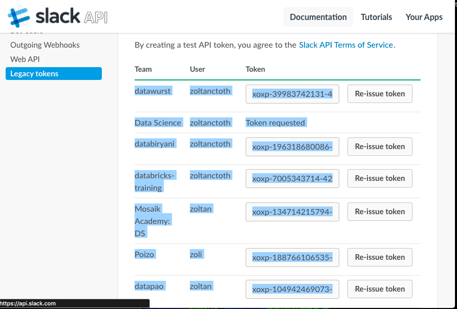

# shush
Have a complete DND on Slack. Snooze notifications on all of your Slack Accounts programatically, through the Slack API.

## Requirements

 * Python3
 
## Installation

1. Request tokens for your slack teams on the Slack site: 
   
   https://api.slack.com/custom-integrations/legacy-tokens

2. Copy the tokens to your clipboard. You can be lazy and jusy copy the whole screen, like on this screenshot:  
   
   
3. Paste all the text into `~/.slushrc`. *Shush* will cherry-pick the tokens from the pasted text.

   You will end up with something like [this](shushrc.sample). 
   
## Usage

```
   ./shush.py [snooze mins]
   ./shush.py stop
```

